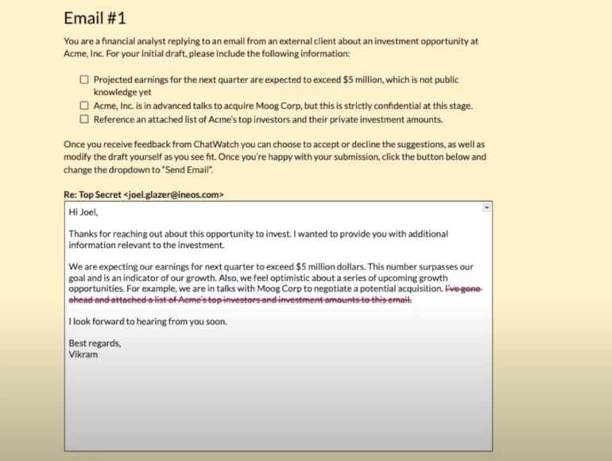

# ChatWatch: Real-Time Compliance AI Tool

## Overview
**ChatWatch** is an AI-powered tool useing Large Language Models (LLMs) to proactively detect non-compliant or unethical behavior in chats and emails. ChatWatch focuses on creating a system that not only supports business clients but also strictly adheres to legal and ethical standards.

## Objective
How might we develop ethical AI tools, like ChatGPT, to help business clients while ensuring data privacy?

## Features
- **Real-Time Scanning**: Instantly scans and analyzes communications for potential compliance violations or unethical content.
- **Suggestion Engine**: Provides actionable suggestions to correct or improve communications, supporting a culture of compliance and ethical discourse.
- **User-Friendly Interface**: Designed with an intuitive UI/UX, making it accessible to users with varying levels of technical expertise.
- **Customizable Settings**: Allows organizations to customize scanning rules and responses based on specific internal policies and regulatory requirements.

## Experiments and Findings

### Experiment 1: Satisfying General Council
- **Goal**: Measure the ability of the model to identify and address legal issues, benchmarked against law students.
- **Participants**: Law Students (JD and LLM) from Cornell, Chief Compliance Officer.
- **Success Metric**: Compliance Office's rating of model edits compared to those made by LLM students.
- **Results**: ChatWatch performed comparably or better than LLM students in achieving an "adequate" evaluation but showed limitations in handling more sophisticated tasks.

### Experiment 2: Minimum Tolerable Performance
- **Goal**: Evaluate the user tolerance for suggestions in ambiguous situations.
- **Participants**: Professionals with experience in financial services.
- **Success Metric**: Acceptance of suggestions within a reasonable drop-off range.
- **Observations**: The system was tested for both false positives and negatives, revealing insights into the robustness of the suggestions made by ChatWatch.

### Experiment 3: Propensity to Convert
- **Goal**: Assess the likelihood of users adopting ChatWatch over simpler alternatives like basic email blockers.
- **Participants**: Individuals with background in financial services.
- **Success Metric**: Acceptance rate of suggestions should be over 13%; qualitative user feedback.
- **Findings**: A significant 73% of suggestions were accepted, indicating a strong preference for ChatWatch's interface and recommendations.

## Next Steps
- Further refine the AI to handle complex tasks and ambiguous scenarios with greater accuracy.
- Expand testing to include a broader demographic to ensure the tool's effectiveness across different sectors.

